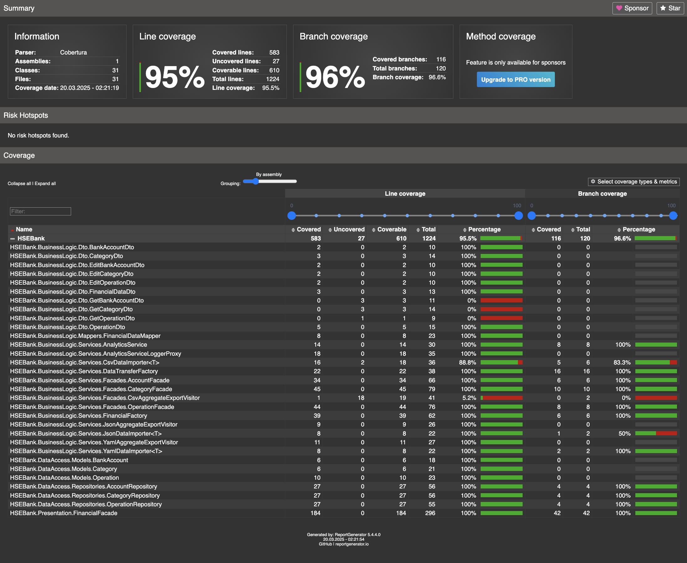

# КПО-КР-№1
## Выполнено студентом БПИ238, Асланян Давид

## 1. Общая идея решения

В данном проекте реализован модуль «Учет финансов», который предоставляет функциональность для работы с основными доменными объектами:
- **Банковские счета (BankAccount)**
- **Категории (Category)**
- **Операции (Operation)** (доходы/расходы)

Приложение представляет собой консольное приложение, позволяющее пользователю создавать, редактировать, удалять и просматривать финансовые данные, а также проводить аналитические расчёты (например, подсчёт разницы между доходами и расходами, группировка операций по категориям). Помимо этого, реализована возможность импорта и экспорта данных в форматах JSON, CSV и YAML.

Решение построено по принципам SOLID и GRASP (High Cohesion, Low Coupling), а также использует ряд паттернов GoF, что обеспечивает гибкость, расширяемость и простоту поддержки системы.

---

## 2. Реализованные паттерны

### 2.1. Фабрика (Factory Pattern)
- **Реализация:** Класс `FinancialFactory`
- **Назначение:** Централизованное создание доменных объектов (BankAccount, Category, Operation) с валидацией входных данных.
- **Преимущество:** Избегание дублирования логики создания объектов, единообразие и возможность лёгкого расширения при необходимости.

### 2.2. Фасад (Facade Pattern)
- **Реализация:** Отдельные фасады для работы с сущностями (`AccountFacade`, `CategoryFacade`, `OperationFacade`) и главный фасад `FinancialFacade`, который объединяет их и предоставляет единый интерфейс для пользователя.
- **Назначение:** Сокрытие сложностей взаимодействия с внутренними сервисами и предоставление простого API для консольного приложения.
- **Преимущество:** Высокая связанность внутри фасадов и низкая связанность между модулями, что соответствует принципам GRASP.

### 2.3. Прокси (Proxy Pattern)
- **Реализация:** Прокси-обёртка для аналитического сервиса – например, `AnalyticsServiceLoggerProxy`.
- **Назначение:** Логирование и измерение времени выполнения аналитических операций без вмешательства в основную бизнес-логику.
- **Преимущество:** Отделение вспомогательных задач (логирование, аудит) от основного функционала.

### 2.4. Посетитель (Visitor Pattern)
- **Реализация:** Экспортеры данных, такие как `JsonAggregateExportVisitor`, `CsvAggregateExportVisitor` и `YamlAggregateExportVisitor`.
- **Назначение:** Экспорт данных без изменения классов доменной модели. Каждый доменный объект реализует метод `Accept`, через который посетитель добавляет данные для последующего экспорта в нужном формате.
- **Преимущество:** Лёгкое расширение функционала экспорта при добавлении новых форматов.

### 2.5. Шаблонный метод (Template Method Pattern)
- **Реализация:** Импортеры данных – `JsonDataImporter`, `CsvDataImporter`, `YamlDataImporter`.
- **Назначение:** Общий алгоритм импорта данных (чтение файла, десериализация) с различной реализацией парсинга для каждого формата.
- **Преимущество:** Упрощает расширение функционала для новых форматов без изменения общей логики импорта.

### 2.6. Синглтон (Singleton Pattern)
- **Реализация:** Главный фасад `FinancialFacade` реализован как синглтон.
- **Назначение:** Гарантировать наличие единственного экземпляра фасада, координирующего работу системы.
- **Преимущество:** Централизованное управление всеми операциями и бизнес-логикой в приложении.

### 2.7. Репозиторий (Repository Pattern)
- **Реализация:** Репозитории для доступа к данным, такие как `AccountRepository`, `CategoryRepository`, `OperationRepository`.
- **Назначение:** Предоставление стандартных CRUD-операций над доменными объектами, абстрагируя детали хранения данных (in‑memory или БД).
- **Преимущество:** Упрощает замену механизма хранения данных без изменений в бизнес-логике.

---

## 3. Соблюдение принципов SOLID и GRASP

### SOLID
- **SRP (Single Responsibility):**  
  Каждый класс имеет одну ответственность: фабрика создаёт объекты, фасады инкапсулируют логику работы с конкретной сущностью, репозитории – доступ к данным, а аналитический сервис – обработку аналитики.
- **OCP (Open-Closed):**  
  Система расширяема – можно добавлять новые импортеры/экспортеры без изменения существующего кода фасадов или репозиториев.
- **LSP (Liskov Substitution):**  
  Интерфейсы позволяют заменять реализации (например, in‑memory или с использованием БД) без нарушения логики.
- **ISP (Interface Segregation):**  
  Интерфейсы разбиты на узкоспециализированные, что позволяет клиентским модулям зависеть только от необходимых методов.
- **DIP (Dependency Inversion):**  
  Высокоуровневые модули зависят от абстракций, а не от конкретных реализаций, что облегчает тестирование и замену компонентов.

## Объяснение настроек DI

**Фасады и репозитории:**  
Регистрация фасадов (`IAccountFacade`, `ICategoryFacade`, `IOperationFacade`) и репозиториев (`IAccountRepository`, `ICategoryRepository`, `IOperationRepository`) выполняется с помощью `AddScoped`. Это означает, что для каждого запроса (например, при вызове из консольного приложения) создаётся новый экземпляр, что удобно для работы с in‑memory хранилищами или при использовании БД.

**Фабрика:**  
`IFinancialFactory` регистрируется для централизованного создания объектов доменной модели. Фабрика инкапсулирует в себе логику создания объектов и их валидации, что помогает избежать дублирования кода в других частях приложения.

**Аналитический сервис и его прокси:**  
Базовый `AnalyticsService` регистрируется отдельно, а затем для интерфейса `IAnalyticsService` создаётся прокси (`AnalyticsServiceLoggerProxy`), который оборачивает базовый сервис. Прокси отвечает за логирование и измерение времени выполнения аналитических операций, не вмешиваясь в основную бизнес-логику.

**Главный фасад (FinancialFacade):**  
Главный фасад регистрируется как синглтон через метод `GetInstance`. Он объединяет в себе функциональность всех нижестоящих фасадов и предоставляет единый интерфейс для взаимодействия с пользователем. Такой подход упрощает управление бизнес-логикой и позволяет централизованно обрабатывать все финансовые операции.

Эта конфигурация DI обеспечивает:
- **Инверсию зависимостей (DIP):** Компоненты зависят от абстракций (интерфейсов), а не от конкретных реализаций, что упрощает тестирование и замену компонентов.
- **Низкую связанность:** Каждый компонент системы зарегистрирован отдельно и взаимодействует через интерфейсы, что позволяет легко модифицировать или расширять функциональность без влияния на остальные части системы.
- **Централизованное управление зависимостями:** DI-контейнер автоматически создаёт и внедряет нужные зависимости, избавляя от необходимости ручного создания объектов.


### GRASP
- **High Cohesion:**  
  Каждый модуль отвечает за свою узкую задачу, что улучшает читаемость и сопровождение кода.
- **Low Coupling:**  
  Модули взаимодействуют через интерфейсы и фасады, что снижает взаимозависимость и упрощает модификацию отдельных частей системы.

---

## 4. Инструкция по запуску приложения

1. **Клонирование репозитория:**  
   Склонируйте проект с GitHub (или другого источника).

2. **У вас есть папка ```examples```, внутри нее:**  
   - папка ```import``` (с примерами json, yaml/yml, csv файлов, которые можно импортировать)
   - папка ```export``` (с примерами результатов экспортов файлов)
   
**Примечание:**

эти файлы из папки ```import```, которая у вас 
в корне проекта вы перекопируйте в папку ```import```, которая находится
в папке ```bin/Debug/net8.0``` данного проекта после как раз таки запуска программы

Потому что при запуске программы (в ```Program.cs``` есть строчки
создания двух папок ```import``` и ```export``` по пути ```bin/Debug/net8.0```):

```
Directory.CreateDirectory("import");
Directory.CreateDirectory("export");
```

в ```bin/Debug/net8.0``` создаются эти две папки.

ну то есть работа идет с файлами не из корня проекта, а с файлами из bin
в корне я просто вынес вам в папку examples уже готовые файлы, чтобы вы не занимались их созданием и не тратили время))

---

### **Глобальные пояснения:**
1. Я сделал так, чтобы при создании аккаунтов 
происходила операция категории Init с зафиксированным айдишником - 
это сделано для того, чтобы при дальнейшем пересчете баланса какого-то аккаунта
у вас учитывался баланс аккаунта, заданный условно из файла.
А то у нас проект в стиле in-memory (без БД) и пересчет баланса идет по операциям, вот поэтому и нужна изначальная 
операция категории Init с типом Income - которая как бы плюсует к балансу заданный инит-баланс.
Для ознакомления можно просмотреть файл ```/DataAccess/Common/Constants/Constants.cs```
и в ```Presentation/FinancialFacade.cs``` метод ```RecalculateBalance```.
2. Если что, можно импортировать как файлы, которые специально сделаны под import,
так и файлы с данными, которые были экспортированы после работы в консоли.
3. Из аналитики сделаны:
   - пересчет баланса для аккаунта
   - группировка операций по категориям 
   - просмотр разницы доходов и расходов за промежуток времени
4. Импорт и экспорт реализован для каждого расширения файлов (json, yaml/yml, csv)
5. Промежутки времени можно вписывать в форматах
   - ```yyyy-mm-dd hh:mm:ss```
   - ```dd.mm.yyyy hh:mm:ss```
---


# Unit тесты
Тесты написаны в отдельном проекте `TestHSEBank` данного решения `HSEBank`

Использовался фреймворк для модульного тестирования **`xUnit`**

Использовались `Theory` и `Fact` атрибуты для тестов.

Покрытие бизнес-логики проекта составило 95%, что больше требуемых в доп.задаче 65%



Для проверки покрытия тестами воспользовался в этот раз
бесплатным сервисом - XPlat Code Coverage (потому что подписка на
JetBrains закончилась....(печалька)) Он генерит процент покрытия в HTML.

Вот инструкция по проверке покрытия (в терминале):
1. переходим в проект TestHSEBank: ```cd TestHSEBank```
2. Запускаем эти команды:
    ```aiignore
    dotnet clean
    dotnet build
    dotnet test --collect:"XPlat Code Coverage"
    ```
3. Выведется сообщение о кол-ве пройденный тестов,
а так же вложение такого формата: ```/Users/david/Desktop/ВШЭ/C#/HSEBank/TestHSEBank/TestResults/3fe53556-f288-47cf-9b5a-c0b01c1f6590/coverage.cobertura.xml```
4. Далее запускаем команду ```reportgenerator -reports:"/Users/david/Desktop/ВШЭ/C#/HSEBank/TestHSEBank/TestResults/3fe53556-f288-47cf-9b5a-c0b01c1f6590/coverage.cobertura.xml" -targetdir:"coverage-report" -reporttypes:Html -classfilters:"-*Program*"```
Тут путь должен быть таким, как был сгенерирован во вложении, описанном в 3 пункте.
5. Теперь запускаем команду ```open coverage-report/index.html```
6. Нас перебрасывает на HTML страницу с результатами покрытия

Если вдруг на этапе выведется это ```zsh: command not found: reportgenerator``` -
тогда введите в консоль команду ```export PATH="$PATH:/Users/david/.dotnet/tools"```

Флаг ```-classfilters:"-*Program*"``` говорит о том, что мы исключаем Program.cs и тестируем бизнес-логику исключительно.

Готово )))
